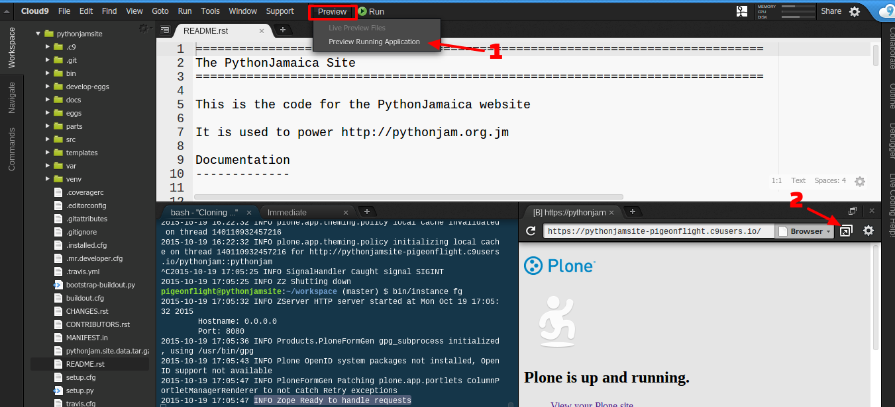
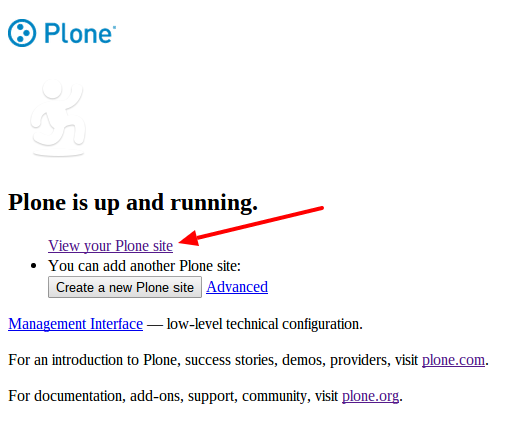

Developer Quickstart
====================

Quickstart on Cloud9 IDE
-----------------------------

To get started with development we recommend using Cloud9 IDE.
It is the fastest way to get started developing on the PythonJamaica website

Start by creating a workspace (the default is fine).

Create a new workspace and under "Clone from Git" use the following git repo URL
https://github.com/PythonJamaica/pythonjam.site.git

.. image:: ../createnewworkspace.png

Then run the following commands in a terminal::

   sudo apt-get install libxslt-dev libxml2-dev -y

Setup a virtualenv and run buildout (takes about 10 minutes)::

   virtualenv venv
   venv/bin/python bootstrap-buildout.py
   bin/buildout
   bin/pulldevdata

Starting the site
~~~~~~~~~~~~~~~~~~~

To start the site, run the following command::

   bin/instance fg

This will launch the site, once you see "INFO Zope Ready to handle requests"

From the IDE click 1) "Preview running app" and 2) click to "pop out in a new window"




You can now to view your Plone site. This will reveal a working copy of the PythonJamaica site.



Logging in
~~~~~~~~~~~~~~~

You can login by visiting /login and using the following credentials::

    username: admin
    password: admin

General Quickstart
-------------------------
If you don't have Cloud9IDE we've also tested the install
on Ubuntu 14.04.
Here are the instructions.
Install the dependencies
::

   sudo apt-get install libxslt-dev libxml2-dev python-dev -y

Setup a virtualenv and run buildout (takes about 10 minutes)::

   virtualenv venv
   venv/bin/pip install -U setuptools
   venv/bin/python bootstrap-buildout.py
   bin/buildout


Install site data
```````````````````````
After installing the buildout you will want to install the site with
some sample data.

To quickly achieve this, run the following command from within your buildout directory::

   bin/pulldevdata


Start the site
````````````````````
To start the site, run the following command::

   bin/instance fg

This will lauch the site on port 8080
