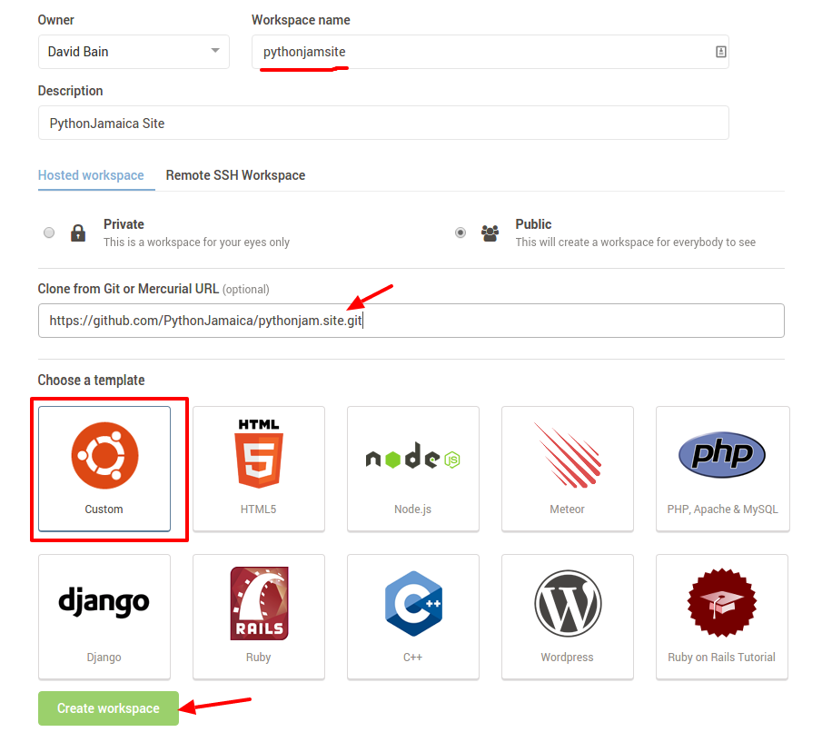

Developer Quickstart
====================

Cloud9 IDE Quickstart (10 - 15 minute setup time)
-----------------------------------------------------

To get started with development we recommend using Cloud9 IDE.
It is the fastest way to get started developing on the PythonJamaica website

Follow our guide below:


Step 1 - Start workspace
```````````````````````````
Start by creating a workspace (the default is fine).

Create a new workspace and under "Clone from Git" use the following git repo URL
https://github.com/PythonJamaica/pythonjam.site.git



Step 2 - Initialise the site
`````````````````````````````

Then run the following commands in a terminal::

   sudo apt-get install libxslt-dev libxml2-dev -y

Setup a virtualenv and run buildout (takes about 10 minutes)::

   virtualenv venv
   cp templates/buildout.cfg.in buildout.cfg
   venv/bin/python bootstrap-buildout.py
   bin/buildout

.. note:: Sometimes `bin/buildout` fails on the first run, just run the `bin/buildout` command again

Then install the development data and enable https::
 
   bin/pulldevdata
   bin/setuphttps

Step 3 - Starting/Stopping the site
```````````````````````````````````````

Starting the site
~~~~~~~~~~~~~~~~~~~

To start the site, run the following command::

   bin/instance fg

This will launch the site, once you see "INFO Zope Ready to handle requests"

From the IDE click 1) "Preview running app" and 2) click to "pop out in a new window"


You can now to view your Plone site. This will reveal a working copy of the PythonJamaica site.


Access it on port 8080 and with username "admin" and password "admin"

Stopping the site
~~~~~~~~~~~~~~~~~~~

Stop the site with the following on the console::

   CTRl + C

Logging in
~~~~~~~~~~~~~~~

You can login by appending  /login to the site url.
Use the following credentials::

    username: admin
    password: admin

Ubuntu 14.04 Quickstart (40 to 60 minute setup time)
-----------------------------------------------------------

If you prefer to develop locally we've also tested the install
on Ubuntu 14.04.
Here are the instructions.
Install the dependencies
::

   sudo apt-get install build-essential libssl-dev libxml2-dev libxslt1-dev libbz2-dev zlib1g-dev python-setuptools python-dev 
   sudo apt-get install libjpeg62-dev libreadline-gplv2-dev python-imaging wv poppler-utils -y

Setup a virtualenv and run buildout (takes about 40 minutes)::

   git clone https://github.com/PythonJamaica/pythonjam.site
   cd pythonjam.site
   virtualenv venv
   venv/bin/pip install -U setuptools
   cp templates/buildout.cfg.in buildout.cfg
   venv/bin/python bootstrap-buildout.py
   bin/buildout


Install site data
```````````````````````
After installing the buildout you will want add a working version of the site with some real data.

To quickly achieve this, run the following command from within your buildout directory::

   bin/pulldevdata


Start the site
````````````````````
To start the site, run the following command::

   bin/instance fg

This will lauch the site on port 8080
